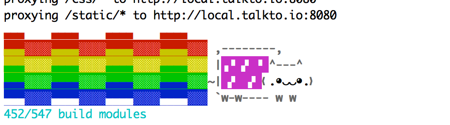
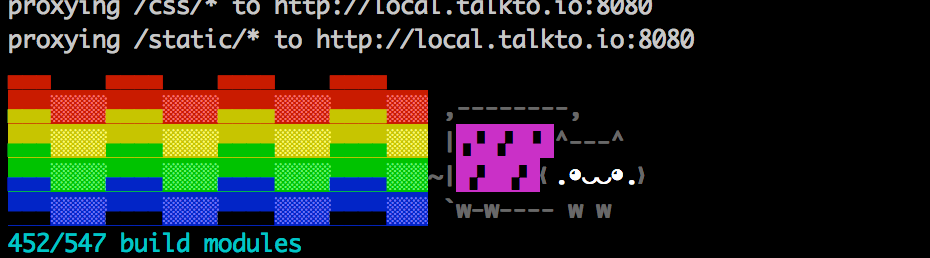

# nyan-progress-webpack-plugin
Meow

 

## Install

```
$ npm i -D nyan-progress-webpack-plugin
```

## Usage

Add this to your webpack plugin:

```
var NyanProgressPlugin = require('nyan-progress-webpack-plugin');

...

plugins: [
  new NyanProgressPlugin()  
]

...
```

**NB**: use `webpack.ProgressPlugin` carefully with this plugin. If you used it just for progress logging, you can remove it.

## Options
```
new NyanProgressPlugin(options)
```
| Name | Signature | Default Value | Description |
|------|-----------|---------------|-------------|
| logger | `function(message, ...)` | `console.log` | Function used for logging |
| hookStdout | Boolean | `true` | If `true`, patches `process.stdout.write` during progress and counts extraneous log messages, to position Nyan Cat properly |
| getProgressMessage | `function(progress, messages, styles)` | `...` | Gets custom progress message. `styles` is provided for convenience (exported from [ansi-styles](https://github.com/chalk/ansi-styles) module) |
| debounceInterval | Number | `180` | Defines how often `getProgressMessage` is called (in milliseconds) |
| nyanCatSays | `function(progress, messages)` | `progress === 1 && 'Nyan!'` | Override this function to define what nyan cat is saying |
| restoreCursorPosition | Boolean | `false` | Enable this flag, if your terminal supports saving/restoring cursor position, for better output handling |
